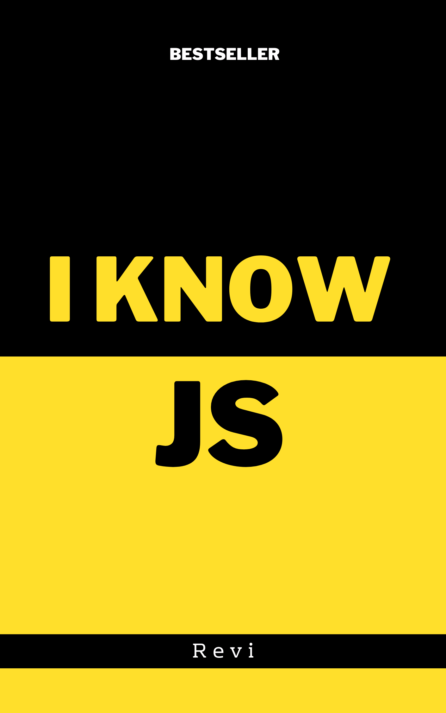

# I Know JS: Get Started - 1st Edition

-----

**[Purchase ebook/PDF from Leanpub](https://leanpub.com/ydkjsy-get-started)**

-----

[Table of Contents](toc.md)

* [Foreword](foreword.md) by [Revi]

* [ECMA](ECMA.md)
* [Preface](../preface.md)
* [Chapter 1: What Is JavaScript?](ch1.md)
* [Chapter 2: Surveying JS](ch2.md)
* [Chapter 3: Digging to the Roots of JS](ch3.md)
* [Chapter 3copy: Digging to the Roots of JS](ch3copy.md)
* [Chapter 4: The Bigger Picture](ch4.md)
* [Appendix A: Exploring Further](apA.md)
* [Appendix B: Practice, Practice, Practice!](apB.md)
